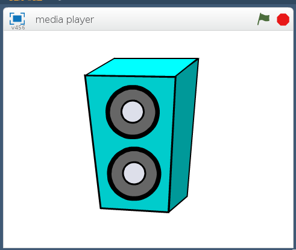

## Making it sparkle

Let's being by getting the Sense HAT to show a random sparkly display to accompany your favorite music.

--- task ---
Open Scratch 2 from the application menu.
[[[rpi-scratch-opening]]]
--- /task ---

--- task ---
Choose a sprite for your MP3 player — here we're going to use a speaker.

[[[generic-scratch3-sprite-from-library]]]
--- /task ---

You can delete any scripts or sounds that are already on your sprite.

--- task ---
Add the **Pi SenseHAT** extension in Scratch.
[[[rpi-scratch3-add-sensehat-extension]]]
--- /task ---

Now you're all set up, you can begin to make your MP3 player by creating a disco effect on the display.

--- task ---
Begin by adding a `when flag clicked`{:class="blockevents"} block, and then add a `forever`{:class="blockcontrol"} block below it.
```blocks3
when flag clicked
forever
```
--- /task ---

Colours can be represented by what are called Hexadecimal codes or *hexcodes* for short. You can see a list of some hexcodes along with the colours they represent below.

<a title="Monaneko [Public domain], via Wikimedia Commons" href="https://commons.wikimedia.org/wiki/File:SVG_Recognized_color_keyword_names.svg"></a>

--- task ---
Create a new variable called `hex`{:class="block3variables"}
--- /task ---

--- task ---
You can begin by setting the value of `hex`{:class="block3variables"} to `#`{:class="block3variables"}

```blocks3
set [hex v] to [#]
```
--- /task ---

--- task ---
Have a go at running your program by clicking on the green flag. You should see the LEDs on the Sense HAT begin to randomly sparkle.
--- /task ---

